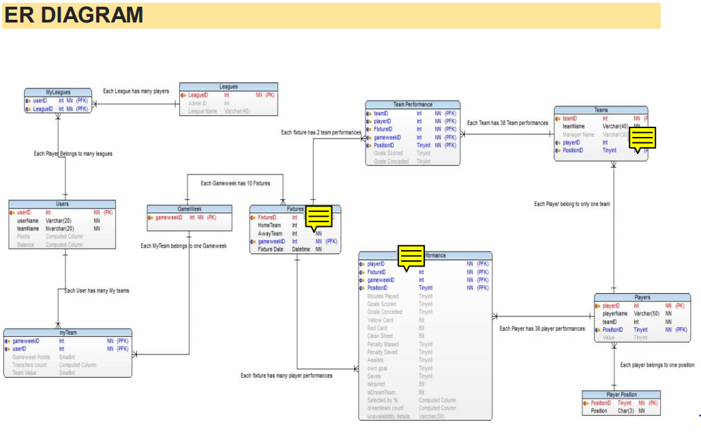
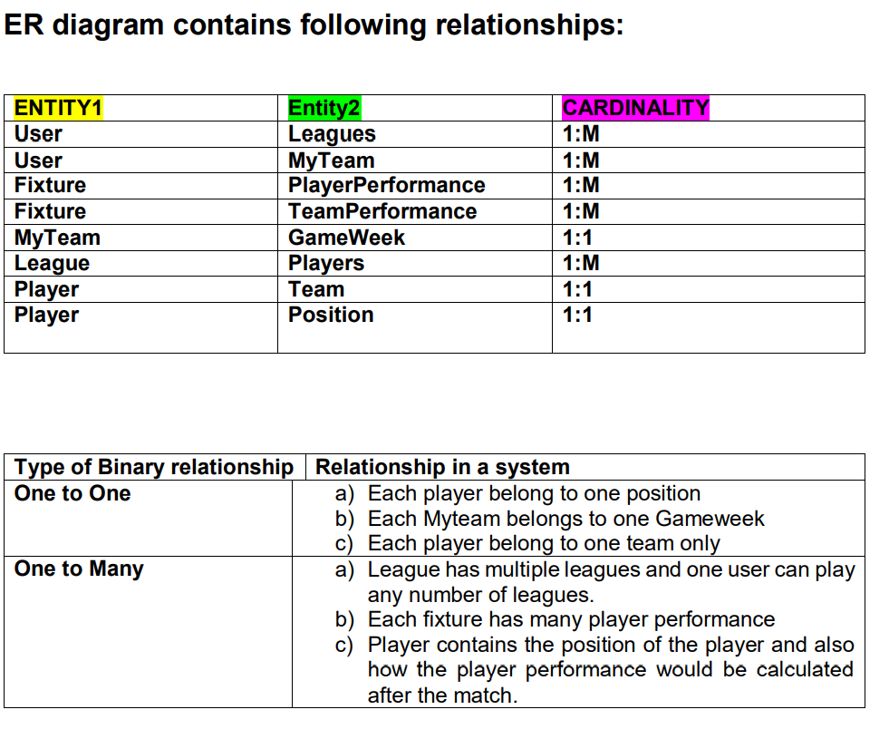
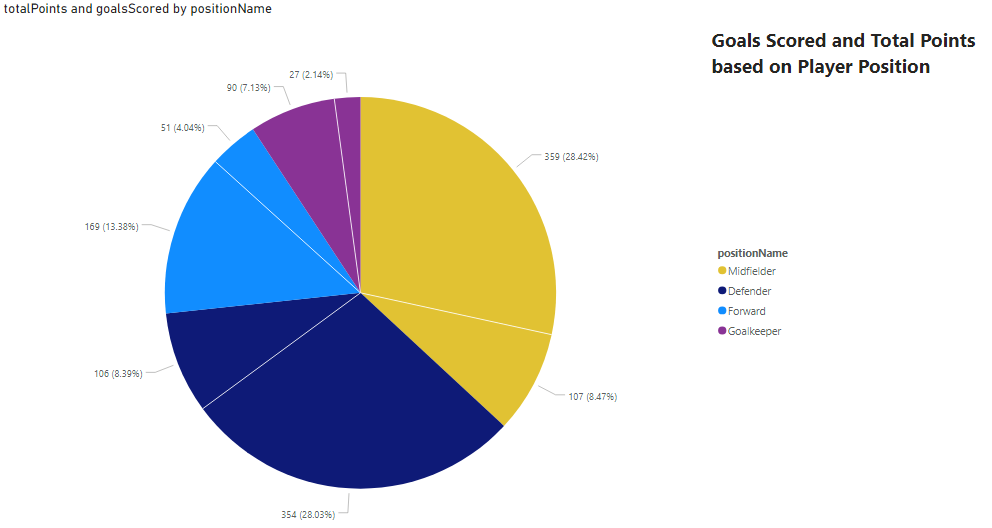
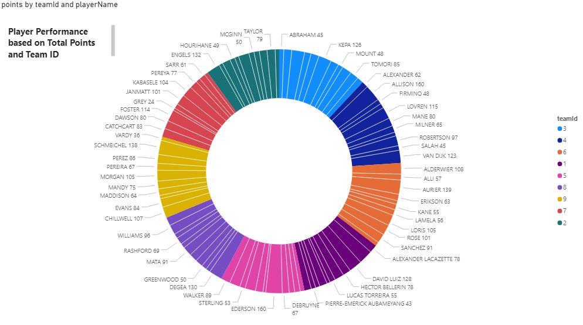

 
 

    
    <h1 align="center">Database Design and Development for Fantasy Football Manager</h1> 

 
## Objective
The objective of this system is to build a Database for the fantasy premier league game played by nearly 7 million users worldwide. Here, Users will have to choose a team/squad of 15 players every week. A squad consists of two goalkeepers, five defenders, five midfielders and three forwards. A maximum of three players can be chosen from anyone Premier League club. Each player has a different value based on his performance. The User whose team scores the most points at the end of the season (38 game weeks) is the winner. Our objective is to maintain this complex database and also provide player suggestions to users through Analytics and Business Intelligence

## Tools Utilized
These are the tools I have utilized for the following project:
* CSS
* Excel
* HTML5
* JavaScript
* Microsoft PowerBI 
* Microsoft SQL server Management Studio
* SQL Server Developer Edition

## Steps of the project:
### 1. Make a any SQL database and run the following files in SQL Server Management Studio

* DDL_COMMANDS1.sql
* DML_COMMANDS.sql
* TRIGGER.sql

# ER Diagram 

# PowerBI Jobs Sample

